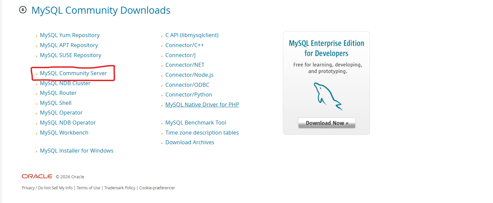
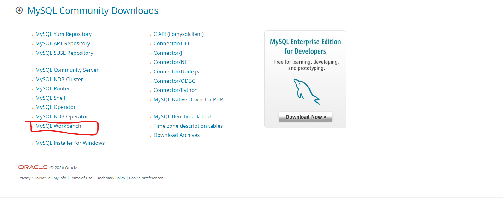

# About the Ticket System
This software is a centralized helpdesk platform built to manage support requests from creation to resolution. It gives teams one place to register issues, prioritize work, track progress, and document outcomes.

The goal is simple: reduce response time, improve communication between users and IT support, and make every ticket fully traceable.
what the system can do:
Create and manage support tickets with title, description, category, status, and priority.
Sort and filter tickets by status and priority from the dashboard.
Track each ticket through its lifecycle: Open, In Progress, Resolved, and Closed.
Show SLA performance so teams can quickly see if deadlines are being met or breached.
Open detailed ticket views with comments, assignment information, and timeline fields.
Update ticket status directly from the selected ticket view.

# nvm install:
https://github.com/coreybutler/nvm-windows?tab=readme-ov-file
scroll down to download now link:

scroll down and download either of these and run program

click through it all and check if its downloaded correctly via. commandpromt

### install node version 22.12.0

nvm install 22.12.0

both node and npm is downloaded in this stage, but good idea to check if downloaded

node -v

running 22.12.0

npm -version

latest version

# angular install

run this command in windows cli

npm install -g @angular/cli 

### create angular project
ng new [project-name]

# maven install

unzip the file and place the now unzipped folder somewhere rememberable and safe

get the filepath for the maven folder and open enviroment variables in windows

create in either user variable or system variable a new variable called MAVEN_HOME with the filepath from the maven folder

if you chose to create the MAVEN_HOME in systems, edit the variable called Path and select new and call it %MAVEN_HOME%\bin. This will ensure that maven is run correctly.

# create quarkus project

Go to this link:
https://code.quarkus.io/

and create the project. artifact is the name of the project and group is a link?

standard dependencies that should be implementet:
- quarkus-hibernate-orm-rest-data-panache
- quarkus-rest
- quarkus-rest-client-jsonb
- quarkus-hibernate-orm-panache
- quarkus-resteasy
- quarkus-smallrye-jwt
- quarkus-jdbc-mysql
- quarkus-arc

# bulma

https://bulma.io/documentation/start/installation/
d
css import: @import "https://cdn.jsdelivr.net/npm/bulma@1.0.4/css/bulma.min.css";

# Mysql workbench + server
## Mysql server
- if it doesnt start the download immediately click on the blue text saying "no thanks, just start my download"

for the mysql server, go to this link: https://dev.mysql.com/downloads/ and choose the msi version for the easiest download 

when downloaded go through these steps:
- choose a directory, for simplicity, use standard route it gives
- for the networking, if your changing anything remember to write the changes down and where, will be important for later
- set a root password, this is to access the db server from your root user. You can add another user, but remember to give them the necessary permissions
- let the server have full permissions for your files unless you know why not to
- no need to create sample databases, there is a create + mock script for the whole database
- execute the configuration

## Download MySQL workbench
download the latest mysql workbench

go to this link https://dev.mysql.com/downloads/ and choose the mysql workbench and begin downloading the msi version for the easiest download

when downloaded go through these steps:
- choose directory, i will be using the standard route it gives
- download the complete package, unless you want to either save space or know you only need specific features
- finish the install
