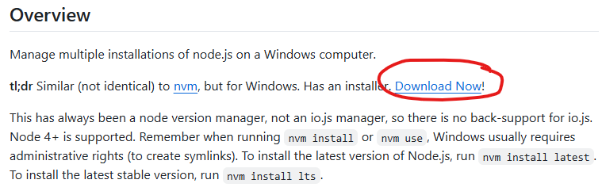
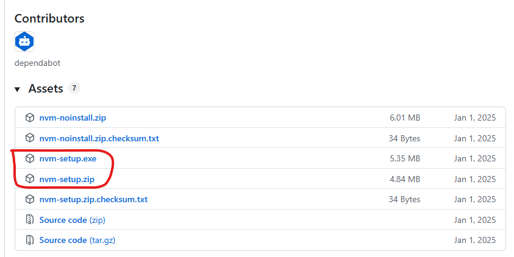
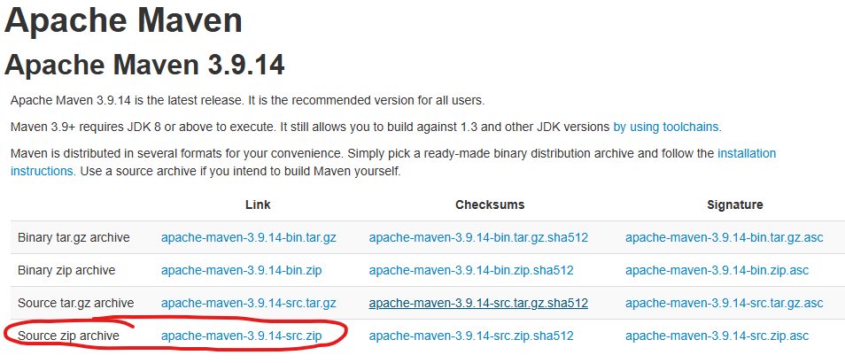
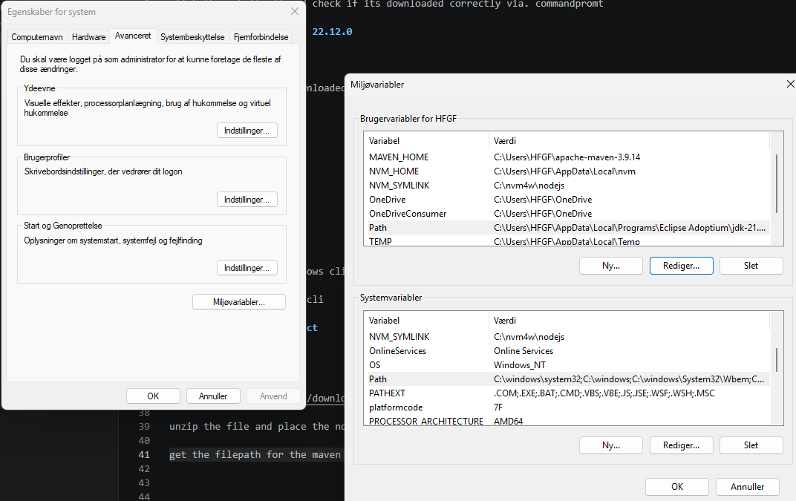
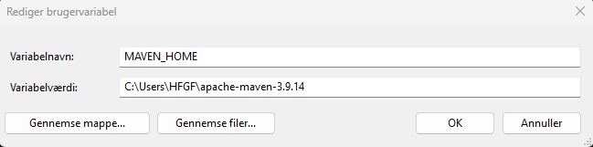
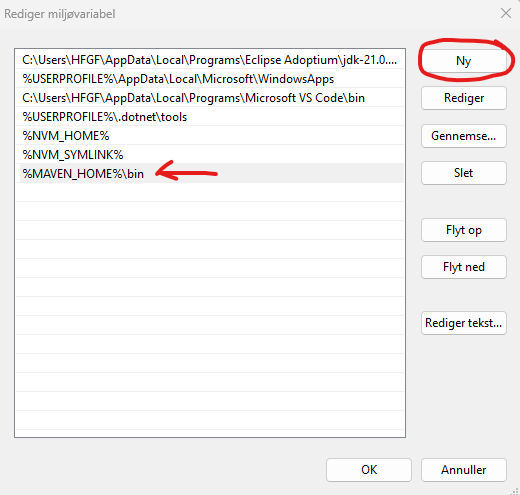

# nvm install:
https://github.com/coreybutler/nvm-windows?tab=readme-ov-file
scroll down to download now link:

scroll down and download either of these and run program

click through it all and check if its downloaded correctly via. commandpromt

### install node version 22.12.0

nvm install 22.12.0

both node and npm is downloaded in this stage, but good idea to check if downloaded

node -v

running 22.12.0

npm -version

latest version

# angular install

run this command in windows cli

npm install -g @angular/cli 

### create angular project
ng new [project-name]

# maven install

unzip the file and place the now unzipped folder somewhere rememberable and safe

get the filepath for the maven folder and open enviroment variables in windows

create in either user variable or system variable a new variable called MAVEN_HOME with the filepath from the maven folder

if you chose to create the MAVEN_HOME in systems, edit the variable called Path and select new and call it %MAVEN_HOME%\bin. This will ensure that maven is run correctly.

# create quarkus project

Go to this link:
https://code.quarkus.io/

and create the project. artifact is the name of the project and group is a link?

standard dependencies that should be implementet:
- quarkus-hibernate-orm-rest-data-panache
- quarkus-rest
- quarkus-rest-client-jsonb
- quarkus-hibernate-orm-panache
- quarkus-resteasy
- quarkus-smallrye-jwt
- quarkus-jdbc-mysql
- quarkus-arc

# bulma

https://bulma.io/documentation/start/installation/

css import: @import "https://cdn.jsdelivr.net/npm/bulma@1.0.4/css/bulma.min.css";

# Download MySQL
download the latest mysql workbench

https://dev.mysql.com/downloads/workbench/